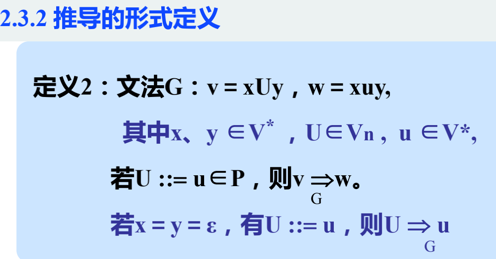
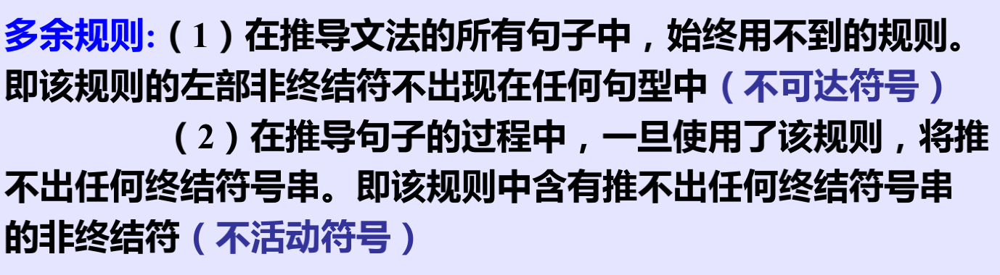
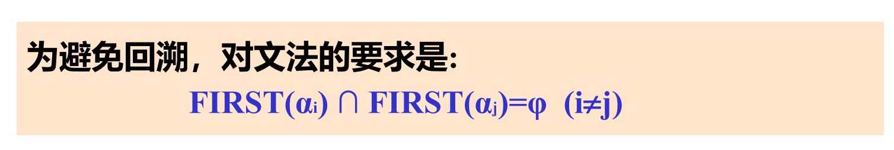
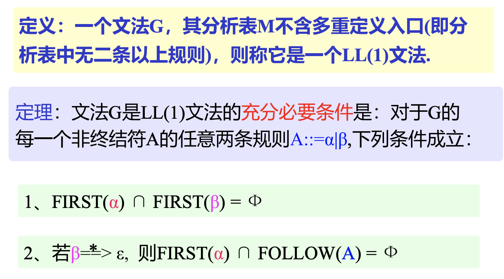
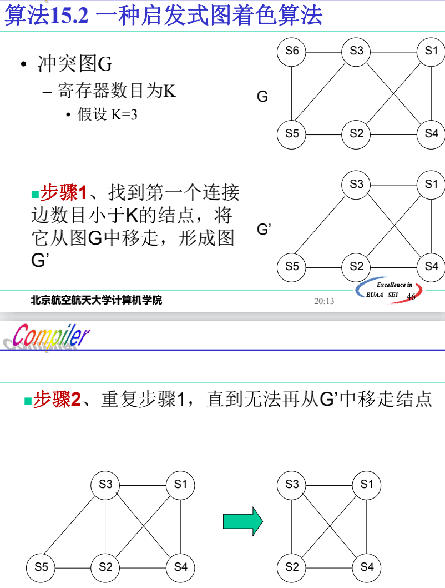

# 第一章 绪论

## 基本概念

源程序：汇编或高级语言编写的程序

目标程序：目标语言表示的程序

目标语言：（介于源语言和机器语言之间的）中间语言/机器语言/目标语言

翻译程序：将源程序转换为目标程序的程序（汇编程序、编译程序、各种变换程序）

汇编程序：汇编语言程序->机器语言程序的翻译程序

编译程序：高级语言程序->目标程序的翻译程序

编译-解释执行：先编译为中间形式，再和输入数据一起输入到解释程序得到输出

## 编译过程

前端：词法分析、语法分析、语义分析生成中间代码、代码优化（与源语言有关）

后端：生成目标程序（与目标机有关）

其他：符号表管理、错误处理

前处理器：源程序到可重定位机器码

后处理器：可重定位机器码经过链接得到可执行程序，经过加载器得到可运行机器码

遍：源程序扫描一次

# 第二章 文法和语言

## 预备知识

若把字符看作符号，则单词就是符号串，单词集合就是符号串的集合。

若把单词看作符号，则句子就是符号串，而所有句子的集合（即语言）就是符号串的集合。

## 文法形式定义

文法：非终结符、终结符、产生式/规则集合、识别符号

**规范推导=最右推导**

### 短语、简单短语、句柄

句柄：最左简单短语

**规范归约：每次归约句柄（最左归约）**

二义性意味着句柄不唯一

## 语言分类

## 消除多余规则

# 第三章 词法分析

单词种类：保留字、标识符、常数、分界符（运算符）

（自底而上分析）

句柄是第一个到达的状态

# 第四章 语法分析

### 左递归

自顶向下分析不能处理左递归

* **消除方法一：使用BNF**

  

* **方法二：改为右递归**

* 消除一般左递归：

### 回溯

* 消除方法一：改写文法

* 超前扫描

**不带回溯的充要条件**

**构造First集合的算法：按照产生式从下到上**

### 构造Follow集合的算法

递归子程序法对应最左推导

# 第五章 符号表管理

非分程序结构语言符号表：全局符号表、局部符号表

分程序结构语言符号表（**栈式符号表**）：

示例

# 第六章 存储管理

静态存储分配：编译阶段由编译程序分配给源程序中变量

要求能够在编译时确定空间大小

动态存储分配：运行阶段由目标程序分配给源程序中变量

### 活动记录

**按照调用顺序（非编译顺序）**

**prevabp指向前一个AR的display区，display区指向能使用的外层模块基地址，ret addr是返回的函数名**

# 第七章 源程序的中间形式

## 波兰表示

BMZ：≤0则跳转

## N元式

简洁三元式：另一张表表示执行顺序

## 抽象机代码

BP：活动记录基地址，SP：栈，NP：堆

Pcode是波兰表示形式的中间代码

# 第八章 错误处理

* 语法错误

* 超越系统限制
  * 不符合语义规则
  * 数据/存储分配溢出

目标程序运行时错误检测：编译时生成检测的代码（数据越界、结果溢出、动态存储分配数据区溢出）

## 错误局部化处理

语法分析：跳过所在的语法成分（短语或语句），跳到语句右界符（语法成分的后继符号/停止符号），然后从新语句继续往下分析。

# 第九章 语法制导翻译

活动序列：终结符（输入序列）+动作符号（动作序列）

翻译文法：终结符号包括输入符号、动作符号，并改写产生式

语法制导翻译：按照翻译文法进行翻译

## 属性翻译文法 - 综合文法

综合属性自底而上、自右向左计算

## 继承属性

继承属性自左向右、自顶向下计算

 ## L型属性翻译文法

左部综合属性传地址，返回时有值

右部综合属性：声明变量并赋值

# 第十一章 词法分析

## 正则表达式

正则表达式和三型文法等价

## NFA确定化

## 最小化

# 第十二章 语法分析

## LL分析

**是最左推导**

## 算符优先分析

不一定是最左归约

## LR分析

是规范归约，每次归约的都是句柄

栈内符号串是规范句型的活前缀，和输入串剩余部分构成规范句型

求有效项目方法：查看状态转移图

# 第十四章 代码优化

分类：

* 局部优化：基本块内，如局部公共子表达式
* 全局优化：函数/过程内，跨基本块，如数据流分析
* 跨函数优化

## 基本块

划分算法：**确定入口语句（第一条、跳转语句后第一条、跳转语句跳转到的第一条）**

## DAG图

## 到达定义分析

**循环执行直至不变**

## 活跃变量分析

**沿流图反向计算**

**循环执行直至不变**

## 冲突图

## 定义-使用链

# 第十五章 目标代码优化

 ##  引用计数

## 着色算法

# 第十六章 编译程序生成方法

## 自编译

## 自展

## 移植

